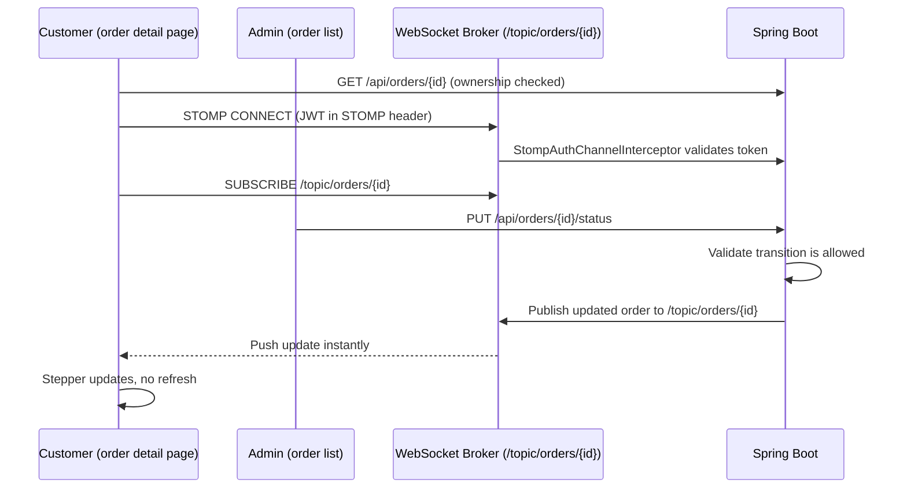
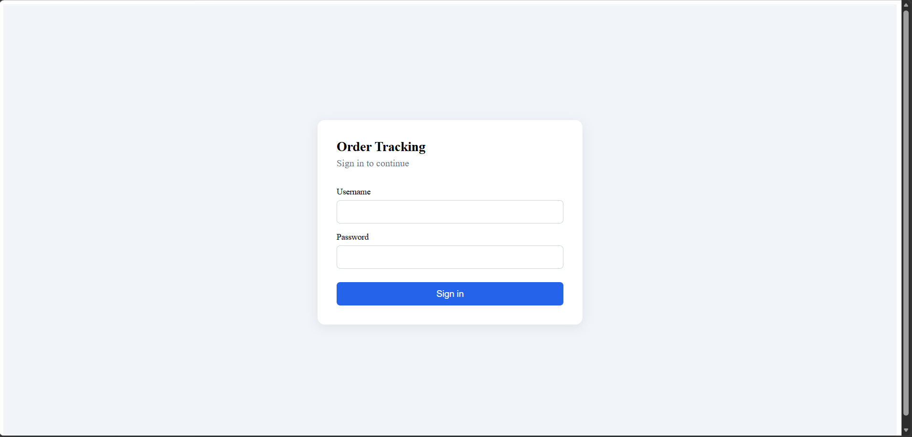
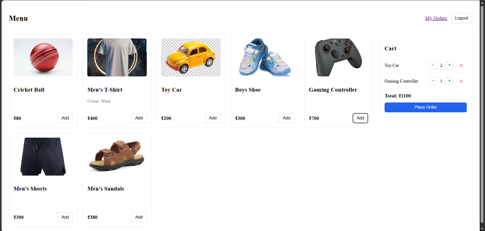
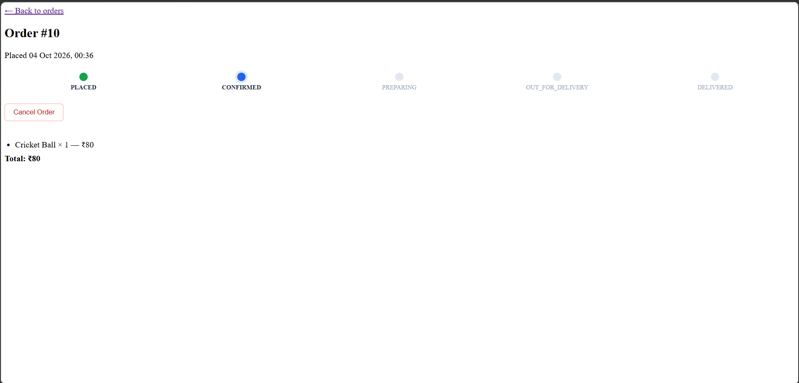
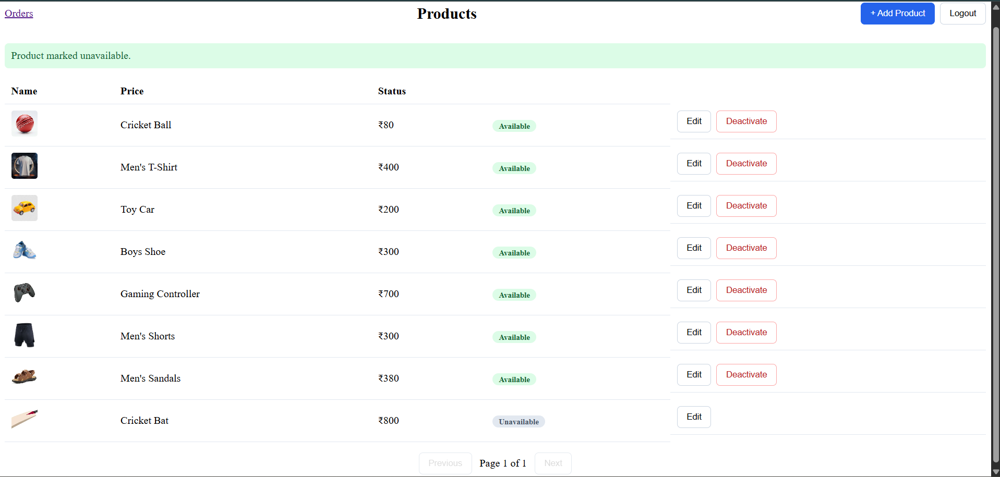
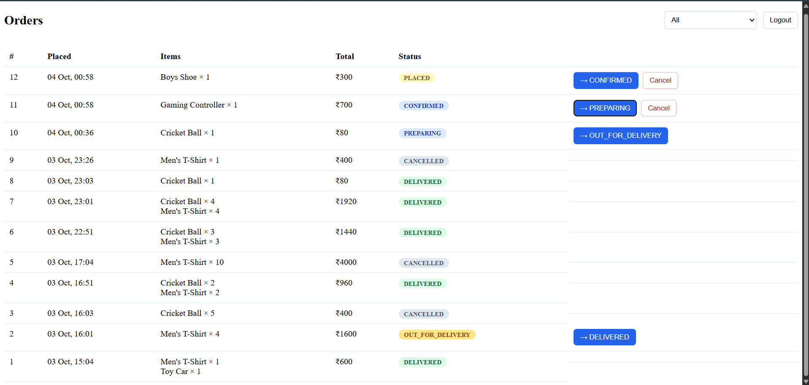
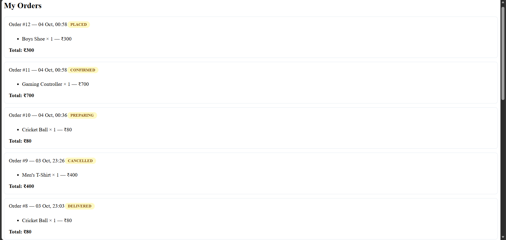

# Order Tracking System

A full-stack, real-time order tracking application built with Spring Boot, Angular, MySQL, and WebSockets. Customers place orders and watch their status update live — no refresh needed — while admins manage products and move orders through a controlled delivery pipeline.

---

## Table of Contents

- [Features](#features)
- [Tech Stack](#tech-stack)
- [Architecture](#architecture)
- [Real-Time Design](#real-time-design)
- [Screenshots](#screenshots)
- [Getting Started](#getting-started)
- [API Overview](#api-overview)
- [Security Design](#security-design)
- [Known Limitations](#known-limitations)
- [What I'd Improve With More Time](#what-id-improve-with-more-time)
- [Author](#author)

---

## Features

- **JWT Authentication** — stateless login, roles (CUSTOMER, ADMIN) enforced via `@PreAuthorize` on every protected endpoint, including the WebSocket handshake itself.
- **Product Catalog** — admin CRUD with images, soft-deactivation (no hard delete, since past orders must keep referencing historical products).
- **Server-Side Cart** — persists per customer in the database, survives refresh and device changes, with per-line quantity increment/decrement.
- **Order Placement** — built entirely from the server-held cart; prices are always re-read from the current product record at order time, never trusted from the client.
- **Real-Time Order Tracking** — a customer's order detail page subscribes to a WebSocket topic and updates its status live the instant an admin changes it, with no polling.
- **Controlled Status Workflow** — orders move through `PLACED → CONFIRMED → PREPARING → OUT_FOR_DELIVERY → DELIVERED` with server-enforced sequential transitions; steps cannot be skipped, even via a direct API call.
- **Customer Self-Service Cancellation** — customers can cancel their own order while it's still early (`PLACED`/`CONFIRMED`), independent of the admin's cancel action.
- **Ownership Enforcement** — a customer can only view, cancel, or receive live updates for their own orders; verified server-side on every relevant call, not just hidden in the UI.

## Tech Stack

**Backend:** Java, Spring Boot, Spring Security, Spring Data JPA, **Spring WebSocket + STOMP**, MySQL, Maven
**Frontend:** Angular (standalone components, signals, reactive forms), **@stomp/stompjs**, TypeScript

## Architecture

'''
order-tracking-system/
├── backend/
│ └── src/main/java/.../order_tracking_system/
│ ├── controller/ # REST + role checks
│ ├── service/impl/ # Business logic: transitions, cart, ownership
│ ├── repository/ # Spring Data JPA
│ ├── entity/ # User, Product, Cart, CartItem, Order, OrderItem
│ ├── security/ # JWT filter, SecurityUtils, StompAuthChannelInterceptor
│ ├── config/ # SecurityConfig, WebSocketConfig
│ └── exception/ # Custom exceptions + GlobalExceptionHandler
└── frontend/
└── src/app/
├── core/ # auth, cart, ws (STOMP client), api, guards
└── pages/ # login, shop, my-orders, order-detail, admin-products, admin-orders
'''


## Real-Time Design



A deliberate design choice worth noting: the browser's native WebSocket handshake cannot carry custom HTTP headers, so the JWT can't be checked at the initial connection. Authentication instead happens one layer up, inside the STOMP `CONNECT` frame itself, via a custom `ChannelInterceptor` — a standard pattern for securing WebSocket + JWT combinations.

## Screenshots

### Login


### Shop & Cart (Customer)


### Live Order Tracking


### Admin: Product Management


### Admin: Order Management


### My Orders


## Getting Started

### Prerequisites
- Java 17+, Maven, MySQL 8+, Node.js, Angular CLI

### Backend Setup
```sql
CREATE DATABASE order_tracking_db;
```
Set environment variables (distinct from any other project's, to avoid collisions):

DB_PASSWORD=<your MySQL password>
JWT_SECRET_OTS=<a random 256-bit+ secret>

```powershell
cd backend
.\mvnw spring-boot:run
```
API: `http://localhost:8080` · Swagger: `http://localhost:8080/swagger-ui/index.html`

### Frontend Setup
```powershell
cd frontend
npm install
ng serve
```
App: `http://localhost:4200`

## API Overview

| Method | Endpoint | Access | Description |
|---|---|---|---|
| POST | `/api/auth/login` | Public | Authenticate, receive JWT |
| POST | `/api/auth/register` | Public | Register (always as CUSTOMER) |
| GET | `/api/products` | Authenticated | Browse available products |
| POST/PUT/DELETE | `/api/products/**` | Admin | Product CRUD |
| GET | `/api/cart` | Authenticated | View own cart |
| POST/PUT/DELETE | `/api/cart/items/**` | Authenticated | Add/adjust/remove cart lines |
| POST | `/api/orders` | Authenticated | Place order from current cart |
| GET | `/api/orders/my` | Authenticated | Own order history |
| GET | `/api/orders/{id}` | Owner or Admin | Single order detail |
| PUT | `/api/orders/{id}/cancel` | Owner | Cancel own order (early stages only) |
| GET | `/api/orders` | Admin | All orders, filterable by status |
| PUT | `/api/orders/{id}/status` | Admin | Advance status (sequential, validated) |
| WS | `/ws` (STOMP) | Authenticated (via CONNECT frame) | Subscribe to `/topic/orders/{id}` |

## Security Design

- **Identity always derived server-side** — every "my" endpoint resolves the user from the JWT via `SecurityUtils`, never from a client-supplied ID.
- **WebSocket authentication is layered, not skipped** — the HTTP handshake is intentionally left open (`/ws/**` permitAll), with real authentication enforced inside the STOMP `CONNECT` frame by a custom interceptor, since browsers cannot attach custom headers to a WebSocket handshake.
- **Order status transitions are a server-side state machine**, not a UI convention — tested directly via Swagger to confirm an invalid jump (e.g. `PLACED` → `DELIVERED`) is rejected with a `400`, regardless of what the frontend would normally allow.
- **Prices are never trusted from the client** — every order line is priced from the current `Product` record at the moment of placing the order.

## Known Limitations

- No delivery-partner role; the admin updates status directly rather than a separate courier flow.
- No payment gateway integration — this project's focus is the real-time tracking mechanism, not checkout/payments.
- Product search/filtering is not implemented; the shop page lists all available products.

## What I'd Improve With More Time

- Add a delivery-partner role with its own restricted view.
- Integrate a test-mode payment gateway (Razorpay/Stripe).
- Add automated tests for the status-transition state machine specifically, since it's the piece most worth regression-testing.

## Author

**Yogeshwaran**
[GitHub](https://github.com/yogesh-000) · [LinkedIn](https://www.linkedin.com/in/yogeshwaran-c/)